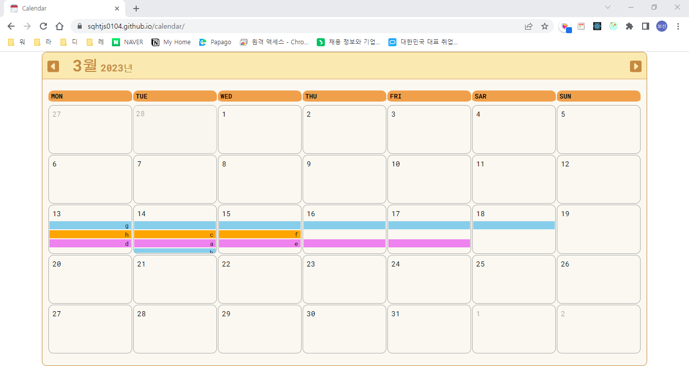

# Calendar
Side project - Calendar

> 2023.02.22 ~ 2023.03.06 ( 7 actual work / 13 total duration )   
> Example site link: https://sqhtjs0104.github.io/calendar/   
> Notion page: https://www.notion.so/Calendar-c878e6a96e584e99a31983f567b4c343

## Skills
- HTML5/CSS3
- SASS
- ReactJS
- Javascript

## Libraries
- styled-components
- sass
- dayjs
- lodash
- @fortawesome/fontawesome-svg-core
- @fortawesome/free-solid-svg-icons
- @fortawesome/react-fontawesome
- react-redux
- @reduxjs/toolkit
- lodash
- gh-pages

## About
dayjs를 중점으로 한 달력 사이트입니다.   
Goolge Firebase console의 Firestore를 이용해 DB를 연동,   
저장한 일정을 공유할 수 있습니다.   

## Supplementable
React state를 이용한 렌더링만으로 구현이 어려워,   
HTML Element를 직접 Create해 append하는 방식이 사용되었습니다.   
이 때문에 렌더링 중복을 막기 위해 고전했고, 아쉽습니다.   
또한 useEffect와 useCallback의 중구난방함이 있습니다.

## Example

